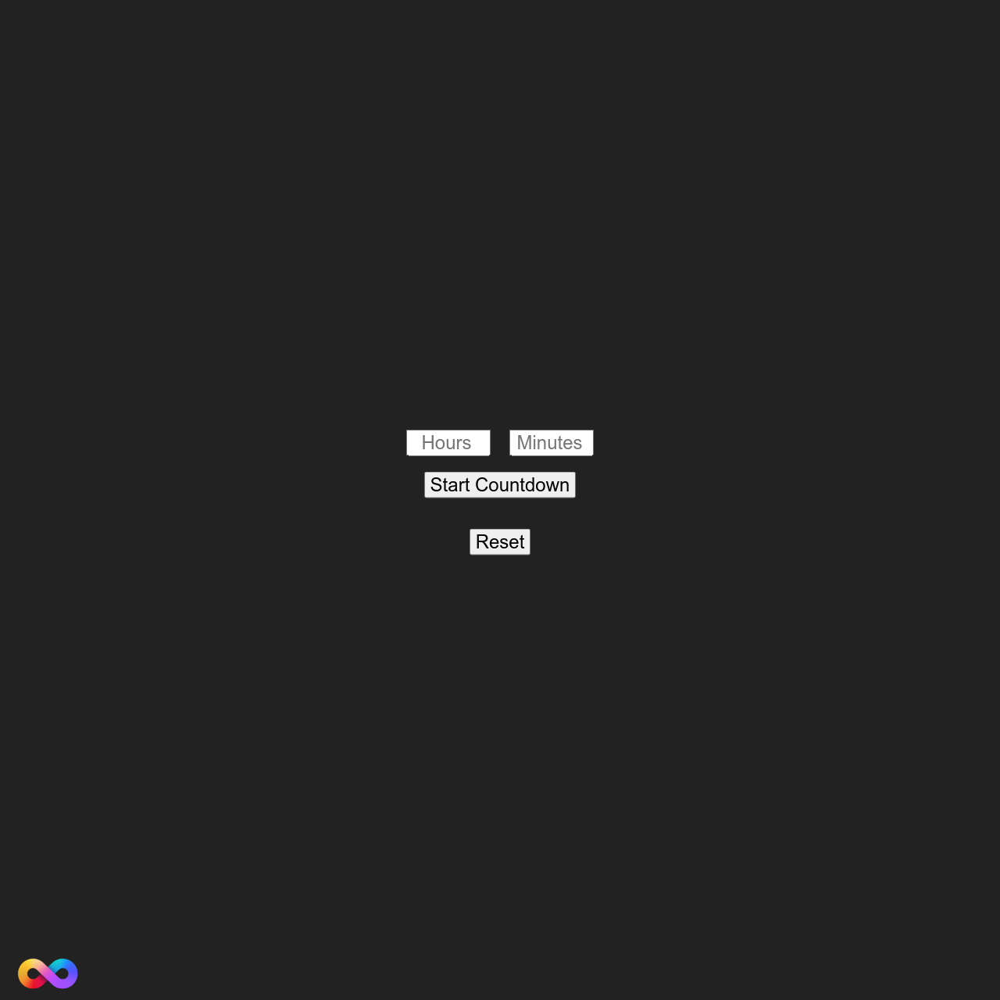

# TheProton Countdown Timer

This project is a customizable countdown timer that allows users to set hours and minutes, visually represented with a water animation that fills the screen as the countdown progresses. It’s a simple yet effective way to track time, featuring offline capability for consistent usage.

## Features
- **Customizable Countdown**: Set a timer using hours and minutes to track events or tasks.
- **Persistent Countdown**: The timer continues even if the page is refreshed, using session storage to keep track of the countdown.
- **Water Animation**: As time passes, a water element fills up, providing a visual indicator of time progression.
- **Responsive Layout**: The interface adapts to different screen sizes, offering a user-friendly experience on both mobile and desktop devices.
- **Info Button**: An easy-to-access button provides instructions on how to use the countdown timer.
- **Service Worker for Offline Capability**: Uses a service worker to cache essential files, allowing the timer to be used offline.

## Files
- **index.html**: Contains the structure for the countdown timer, including inputs for setting hours and minutes, buttons for starting and resetting, and an information modal.
- **style.css**: Provides the styles for the entire page, including animations for the water element and styling for buttons, input fields, and other elements.
- **script.js**: Implements the countdown logic, including timer calculations, the water animation, and handling session storage to ensure the countdown persists across refreshes.
- **sw.js**: Implements the service worker, responsible for caching files to ensure the countdown timer works offline.

## Technologies Used
- **HTML5**: Provides the structure for the countdown timer, including input fields, buttons, and information sections.
- **CSS3**: Styles the layout and all elements, with specific animations for the water effect that visually represents time passing.
- **JavaScript (with jQuery)**: Implements the countdown logic, manages the water animation, and interacts with session storage to persist countdown data.
- **Service Worker**: Provides offline support by caching key files during the installation phase, allowing for limited offline functionality.

## Screenshot

## License
This project is open-source and available under the MIT License.

